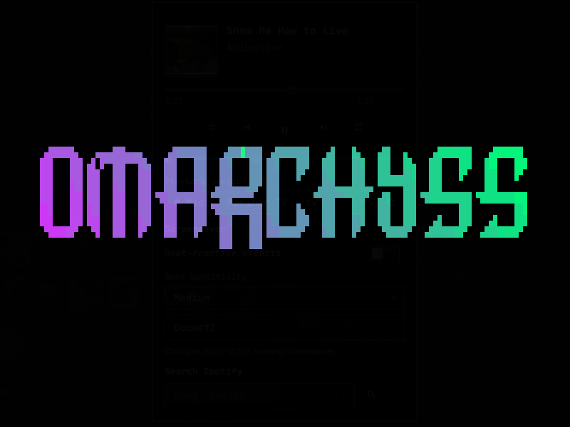
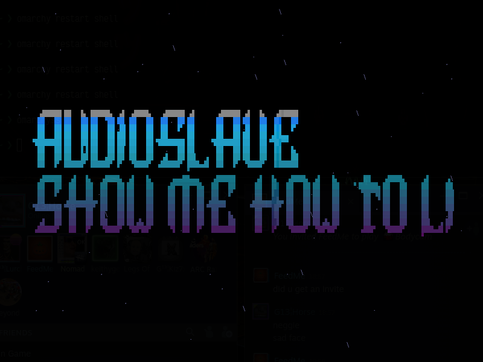
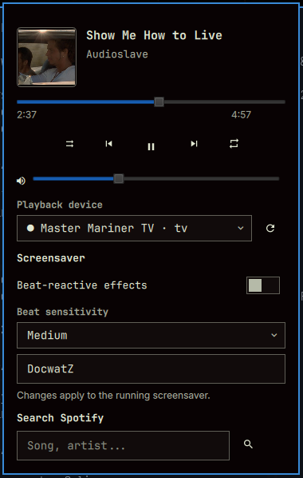

# OmarchySS

OmarchySS is an [Omarchy](https://omarchy.org/) bar plugin that launches a
dedicated terminal screensaver. It uses TTFX animations, can render the
current Spotify artist and title, and supplies Spotify controls directly from
the bar.

## Screenshots

<p align="center">
  
  
</p>

<p align="center">
  
</p>

## Features

- Left-click to start or stop a dedicated Alacritty or Foot screensaver window.
- TTFX effect selection, including a random mode.
- Render Omarchy branding, custom text, or the current Spotify artist and
  track title.
- Right-click opens a Spotify popup, middle-click next, and scroll for
  previous/next.
- The popup shows album art, track/artist, a live progress bar with seek,
  volume, shuffle/repeat, and transport controls — all driven directly by
  Quickshell's native MPRIS service, so it updates instantly for Spotify and
  spotifyd. It never controls unrelated media players such as a browser.
- Optional Spotify catalog **search** from the same popup: search by song or
  artist and play it on the selected Spotify Connect device. When no device
  is active, OmarchySS starts its own headless player. This is a separate,
  opt-in feature from MPRIS controls (see [Spotify search
  setup](#spotify-search-setup)).
- A Spotify Connect device selector for moving playback between OmarchySS,
  phones, TVs, speakers, and other available devices.
- Optionally pause Spotify for the screensaver session and resume it on exit.
- Optional auto-close timer.
- Adjustable terminal font size (default: 28pt).
- Beat-reactive animation cycling: Cava analyzes local PipeWire audio and
  each detected bass beat advances to another TTFX effect.
- A registered Omarchy global action for binding a keyboard shortcut.

## Requirements

`ttfx`, `jq`, `hyprctl`, and either Alacritty or Foot are required. Spotify
metadata, player controls, and the screensaver's pause-on-start/resume-on-stop
behavior require `playerctl`; beat-reactive effects require `cava`.
Spotify search and built-in playback additionally require `python3`,
`secret-tool` (part of `libsecret`), and `spotifyd`. Python and libsecret
ship by default on Omarchy.

```bash
omarchy pkg add playerctl cava spotifyd figlet
```

Beat detection works when audio is playing through this computer. Spotify
Connect playback transferred to a TV, phone, or speaker has no local
PipeWire audio stream for Cava to analyze. Beat-reactive mode keeps playback
running even when **Pause Spotify while active** is enabled.

## Install

```bash
omarchy plugin add https://github.com/DocwatZ/omarchyss.git --enable
```

Add the bundled terminal command to your `PATH` once:

```bash
~/.config/omarchy/plugins/io.github.docwatz.omarchyss/bin/omarchyss install
```

Then configure OmarchySS through the bar widget settings and run `omarchyss`
to toggle it from a terminal. `omarchyss restart` picks up the current widget
settings, while `omarchyss --help` lists explicit commands and options.

FIGlet mode works with any font bundled by the `figlet` package. Set **FIGlet
font** to a name such as `standard`, `big`, `slant`, `block`, `shadow`, or
`script`; `standard` is the default. A path to a personally installed `.flf`
file remains supported; a missing local font automatically falls back to
`standard`.

The bar popup also provides quick **Beat-reactive effects**, **Beat
sensitivity**, and **Custom text** controls. High sensitivity follows smaller
audio transients; Medium and Low reduce effect changes. Custom text replaces
the artist/track display; clearing the field restores artist and track
metadata. Changes restart and update an active screensaver automatically.

## Shortcut

The plugin registers `io.github.docwatz.omarchyss:toggle`. Add a persistent
Hyprland binding in `~/.config/hypr/bindings.lua`, selecting a key that does
not conflict with your existing bindings:

```lua
hl.bind("SUPER + SHIFT + S", hl.dsp.global("io.github.docwatz.omarchyss:toggle"))
```

## Spotify search setup

Player controls (play/pause/seek/volume/shuffle/repeat) appear when Spotify
desktop or OmarchySS's `spotifyd` device exposes a Spotify MPRIS player. To
enable Spotify catalog search and start playback of a chosen track, complete a
one-time login using either method:

- **GUI:** Right-click the bar icon and click **Connect Spotify**.
- **Terminal:**
  ```bash
  PLUGIN_DIR=~/.config/omarchy/plugins/io.github.docwatz.omarchyss
  python3 "$PLUGIN_DIR/bin/omarchyss-spotify" setup
  ```

A browser opens for Spotify approval. The Web API refresh token is stored in
the system keyring (`secret-tool`/gnome-keyring). The playback authorization
is stored in a user-only file under `~/.local/state/omarchyss/`.

OmarchySS then starts its own headless Spotify Connect device through
`spotifyd` (which uses librespot internally), so the Spotify desktop app does
not need to be open. Playback requires Spotify Premium.

Nothing is sent anywhere except Spotify's own API.

## Uninstall

Disconnect Spotify first if you completed the optional setup, then remove the
plugin:

```bash
PLUGIN_DIR=~/.config/omarchy/plugins/io.github.docwatz.omarchyss
python3 "$PLUGIN_DIR/bin/omarchyss-spotify" logout
omarchy plugin remove io.github.docwatz.omarchyss
```

To also remove OmarchySS preferences and its local Spotify playback cache:

```bash
rm -rf ~/.config/omarchyss ~/.local/state/omarchyss
```

## License

MIT. See [LICENSE](LICENSE).
